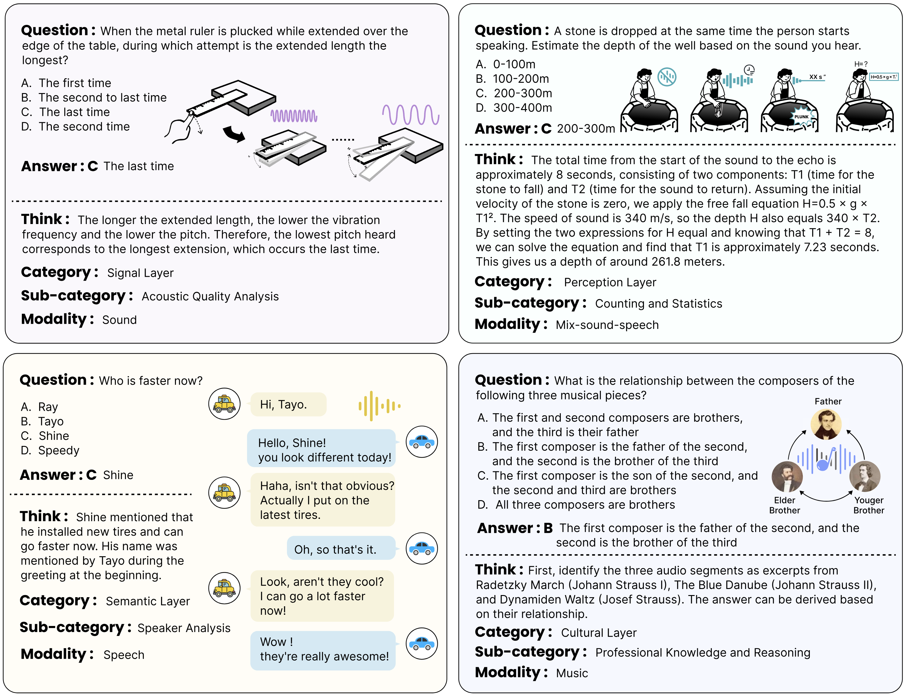
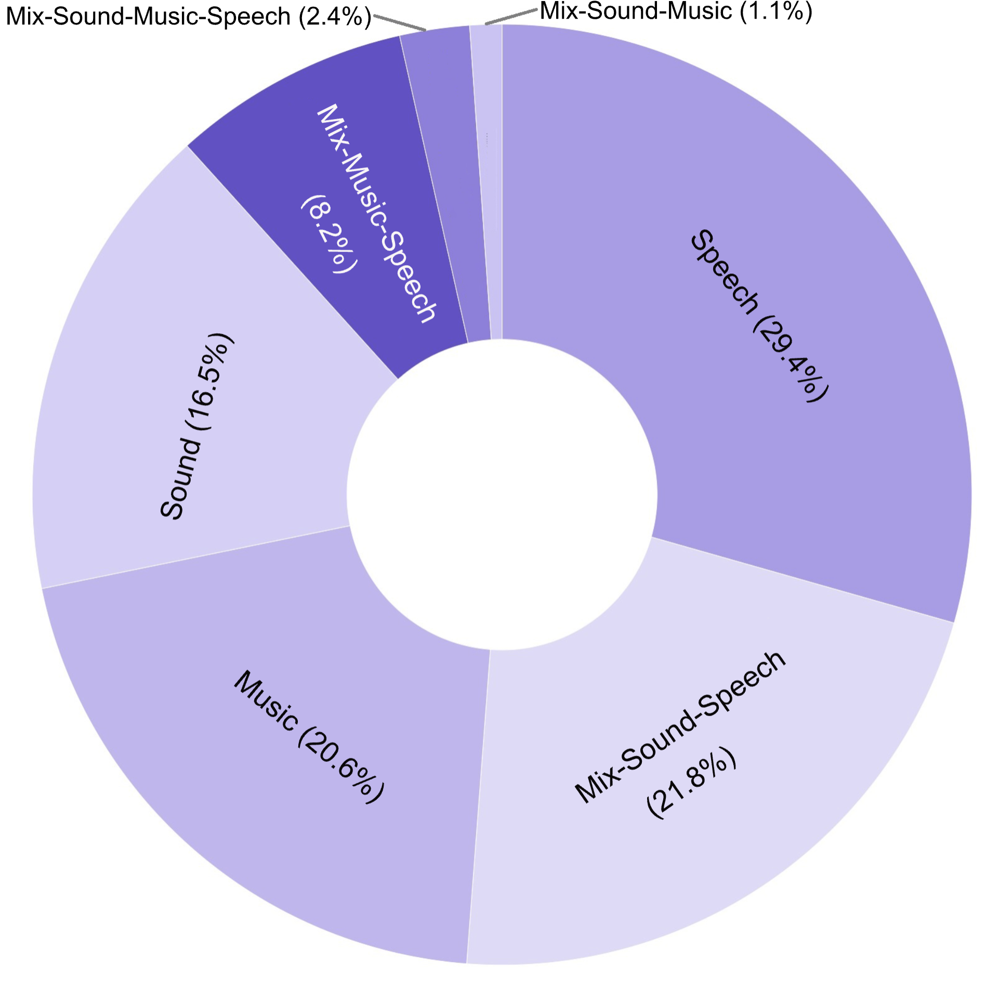
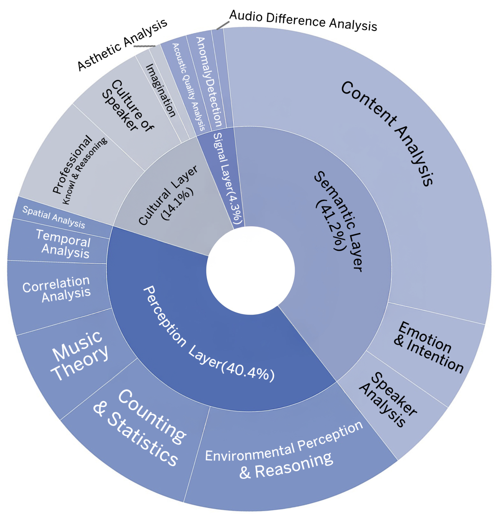
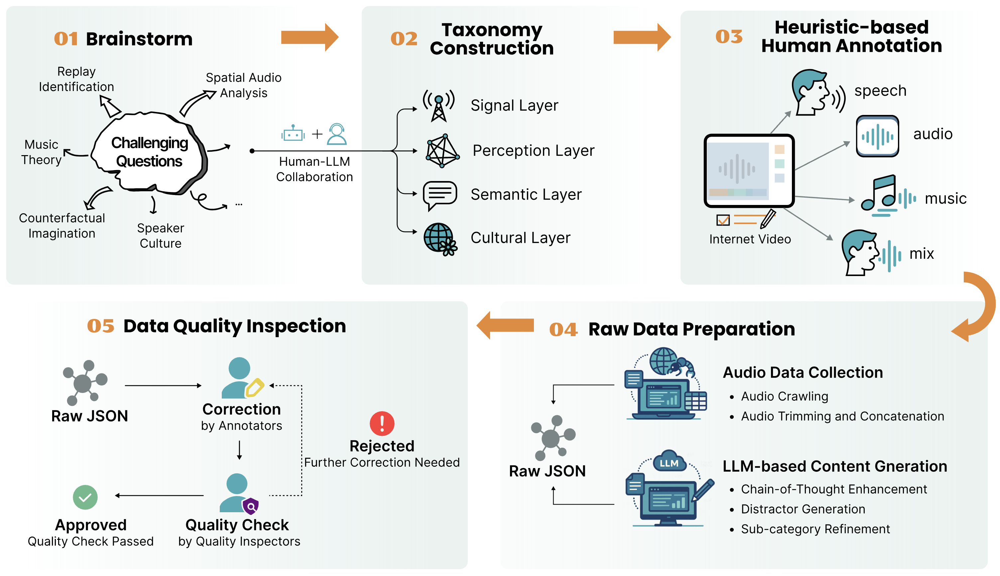

# MMAR: A Challenging Benchmark for Deep Reasoning in Speech, Audio, Music, and Their Mix
[**📖 arXiv**](https://arxiv.org/abs/2505.13032) | [**🎬 MMAR Demo Video**](https://www.youtube.com/watch?v=Dab13opIGqU) | [**🛠️ GitHub Code**](https://github.com/ddlBoJack/MMAR) | [**🔊 MMAR Audio Download (HuggingFace)**](https://huggingface.co/datasets/BoJack/MMAR)
                                          
<p align="center"></p>

## News
- [Feb. 2026] Final results of the Interspeech 2026 Audio Reasoning Challenge are now available on the [leaderboard page](https://audio-reasoning-challenge.github.io/leaderboard)! Check out our [challenge report](https://arxiv.org/abs/2602.14224) for a detailed analysis and insights.
- [Feb. 2026] We released the **MMAR-Rubrics**, an updated version of the MMAR benchmark with a novel instance-level rubric-based protocol for reasoning process quality evaluation. Check out the [evaluation script](code/evaluation_rubrics.py) for more details. 
- [Dec. 2025] We organized **[the Interspeech 2026 Audio Reasoning Challenge](https://audio-reasoning-challenge.github.io/)**, with both [Single Model Track](https://www.codabench.org/competitions/12460/) and [Agent Track](https://www.codabench.org/competitions/12459/), to advance the research on audio reasoning.

## Overview of MMAR
We introduce MMAR, a new benchmark designed to evaluate the deep reasoning capabilities of Audio-Language Models (ALMs) across massive multi-disciplinary tasks. 
MMAR comprises 1,000 meticulously curated audio-question-answer triplets, collected from real-world internet videos and refined through iterative error corrections and quality checks to ensure high quality. 
Each item in the benchmark demands multi-step deep reasoning beyond surface-level understanding. Moreover, a part of the questions requires graduate-level perceptual and domain-specific knowledge, elevating the benchmark's difficulty and depth. 
Examples include:



The metadata for MMAR is available in [this file](MMAR-meta.json). Unlike previous benchmarks, MMAR not only covers traditional modalities such as speech, audio, and music, but also extends to their mix, collected from in-the-wild videos. The distribution of data across these modalities is illustrated in the left figure. Furthermore, each question is annotated with a designated category and sub-category, as shown in the right figure.

For each question, we also provide the URL and corresponding timestamp of the original video, as well as the spoken language (if present) in the clip. To prevent potential data leakage into training for reasoning models, we have withheld reasoning cues and chain-of-thought annotations, which will be released at an appropriate time.

<p float="left">
  
  
</p>

## Leaderboard
We benchmark the models (open-source or API) on MMAR across five model categories: 
1. Large Audio Language Models (LALMs)
2. Large Audio Reasoning Models (LARMs)
3. Omni Language Models (OLMs)
4. Large Language Models (LLMs) with audio captions as input
5. Large Reasoning Models (LRMs) with audio captions as input

| Models                                  | Size  | Open Source | Avg    | Sound   | Music   | Speech  | Sound-Music | Sound-Speech | Music-Speech | Sound-Music-Speech |
|---|---|---|---|---|---|---|---|---|---|---|
| Random Guess                            | -     | -           | 29.3   | 29.4    | 25.9    | 31.5    | 25.0        | 29.3         | 31.1         | 28.1               |
|---|---|---|---|---|---|---|---|---|---|---|
| **Large Audio Language Models (LALMs)** |       |             |        |         |         |         |             |              |              |                    |
| 🏅GPT-4o Audio                            | -     | ❌          | 63.5   | 53.9    | 51.0    | 70.4    | 63.6        | 72.5         | 62.2         | 75.0               |
| 🥈Omni-R1                                  | 8.4B  | ✅          | 63.4   | 67.3    | 51.5    | 64.3    | 45.5        | 70.2         | 64.6         | 70.8               |
| 🥉GPT-4o mini Audio                       | -     | ❌          | 50.6   | 38.8    | 35.9    | 58.8    | 45.5        | 60.1         | 57.3         | 50.0               |
| R1-AQA                                  | 8.4B  | ✅          | 47.6   | 55.8    | 37.4    | 49.0    | 9.1         | 50.0         | 50.0         | 50.0               |
| SALMONN                                 | 7B    | ✅          | 32.8   | 30.9    | 29.6    | 34.4    | 9.1         | 37.6         | 28.1         | 37.5               |
| Qwen2-Audio                             | 8.4B  | ✅          | 30.4   | 33.9    | 23.3    | 33.0    | 9.1         | 33.0         | 26.8         | 33.3               |
| Qwen2-Audio-Instruct                    | 8.4B  | ✅          | 30.0   | 33.3    | 24.3    | 32.3    | 9.1         | 31.2         | 30.5         | 25.0               |
| Audio Flamingo                          | 2.2B  | ✅          | 26.6   | 32.7    | 21.8    | 24.8    | 18.2        | 30.3         | 24.4         | 25.0               |
| GAMA                                    | 7B    | ✅          | 26.5   | 29.1    | 24.3    | 27.9    | 27.3        | 24.8         | 28.1         | 20.8               |
| Qwen-Audio-Chat                         | 8.4B  | ✅          | 23.5   | 27.9    | 20.4    | 22.1    | 9.1         | 25.2         | 25.6         | 20.8               |
| Audio Flamingo 2                        | 0.5B  | ✅          | 23.0   | 20.6    | 20.4    | 24.2    | 27.3        | 23.9         | 26.8         | 25.0               |
| Audio Flamingo 2                        | 1.5B  | ✅          | 22.9   | 26.7    | 20.9    | 22.8    | 9.1         | 22.9         | 23.2         | 20.8               |
| Audio Flamingo 2                        | 3B    | ✅          | 21.9   | 24.9    | 17.5    | 20.8    | 18.2        | 26.6         | 23.2         | 8.3                |
| LTU                                     | 7B    | ✅          | 19.2   | 19.4    | 19.9    | 14.0    | 18.2        | 24.8         | 22.0         | 16.7               |
| LTU-AS                                  | 7B    | ✅          | 19.0   | 20.0    | 14.1    | 19.1    | 9.1         | 20.6         | 28.1         | 12.5               |
| GAMA-IT                                 | 7B    | ✅          | 17.4   | 22.4    | 16.0    | 12.2    | 36.4        | 22.5         | 14.6         | 12.5               |
| MU-LLaMA                                | 7B    | ✅          | 13.9   | 13.9    | 13.6    | 15.0    | 9.1         | 12.4         | 14.6         | 16.7               |
| MusiLingo                               | 7B    | ✅          | 6.6    | 9.1     | 7.3     | 4.1     | 9.1         | 6.9          | 7.3          | 8.3                |
|---|---|---|---|---|---|---|---|---|---|---|
| **Large Audio Reasoning Models (LARMs)**|       |             |        |         |         |         |             |              |              |                    |
| 🏅Qwen3-Omni-Thinking                          | 30B-A3B  | ✅          | 66.4   | 57.6    | 44.7    | 78.2    | 63.4        | 75.2         | 69.5         | 79.1               |
| 🥈Audio-Reasoner                          | 8.4B  | ✅          | 36.8   | 43.6    | 33.5    | 33.0    | 45.5        | 42.7         | 31.7         | 25.0               |
| 🥉Audio-CoT                               | 8.4B  | ✅          | 31.3   | 35.8    | 25.2    | 34.0    | 9.1         | 30.7         | 30.5         | 37.5               |
| Mellow                                  | 167M  | ✅          | 30.0   | 33.3    | 26.7    | 24.8    | 18.2        | 37.2         | 32.9         | 29.2               |
|---|---|---|---|---|---|---|---|---|---|---|
| **Omni Language Models (OLMs)**         |       |             |        |         |         |         |             |              |              |                    |
| 🏅Gemini 2.5 Pro                        | -     | ❌          | 74.7   | 67.3    | 56.8    | 82.0    | 100        | 84.9         | 80.5         | 66.7               |
| 🥈Gemini 2.5 Flash                        | -     | ❌          | 68.4   | 60.0    | 53.4    | 77.2    | 63.6        | 76.2         | 69.5         | 75.0               |
| 🥉Gemini 2.0 Flash                        | -     | ❌          | 65.6   | 61.2    | 51.0    | 72.1    | 81.8        | 72.5         | 65.9         | 70.8               |
| Qwen2.5-Omni                           | 10.7B    | ✅          | 56.7   | 58.8    | 40.8    | 59.9    | 54.5        | 61.9         | 67.1         | 58.3               |
| Qwen2.5-Omni                           | 5.5B    | ✅          | 53.8   | 53.9    | 46.1    | 53.7    | 36.4        | 60.1         | 57.3         | 58.3               |
| Baichuan-Omni-1.5                       | 11B   | ✅          | 40.7   | 41.2    | 33.0    | 40.5    | 36.4        | 48.6         | 39.0         | 41.7               |
| OpenOmni                                | 8B    | ✅          | 27.0   | 20.6    | 22.3    | 35.4    | 18.2        | 27.1         | 23.2         | 25.0               |
| AnyGPT-chat                             | 8B    | ✅          | 23.7   | 24.2    | 19.4    | 22.1    | 27.3        | 27.5         | 26.8         | 29.2               |
|---|---|---|---|---|---|---|---|---|---|---|
| **Large Language Models (LLMs)**        |       |             |        |         |         |         |             |              |              |                    |
| Caption + GPT-4o                        | -     | ❌          | 50.7   | 46.1    | 40.3    | 60.9    | 27.3        | 53.7         | 46.3         | 45.8               |
| Caption + DeepSeek-V3                   | 671B  | ✅          | 47.6   | 42.4    | 40.8    | 56.1    | 18.2        | 50.0         | 45.1         | 37.5               |
|---|---|---|---|---|---|---|---|---|---|---|
| **Large Reasoning Models (LRMs)**       |       |             |        |         |         |         |             |              |              |                    |
| Caption + DeepSeek-R1                   | 671B  | ✅          | 55.5   | 46.7    | 49.5    | 62.6    | 45.5        | 58.7         | 56.1         | 54.2               |
| Caption + OpenAI o3                     | -     | ❌          | 54.7   | 49.7    | 41.8    | 64.0    | 36.4        | 60.1         | 52.4         | 54.2               |
| Caption + OpenAI o1                     | -     | ❌          | 53.0   | 48.5    | 43.2    | 63.6    | 18.2        | 56.9         | 45.1         | 45.8               |

## Dataset Creation
The MMAR benchmark was constructed with a comprehensive pipeline. The process includes: 
1. Brainstorming challenging questions
2. Building a taxonomy through human-LLM collaboration
3. Heuristic-based data collection and annotation
4. Crawling audio data and enriching content across multiple slots
5. Performing iterative correction and quality inspection to ensure high data fidelity



## Test Your Model !

### MMAR Accuracy Evaluation Script
To ensure a smooth integration into existing evaluation pipelines, we adopt an evaluation methodology modified from [MMAU](https://github.com/Sakshi113/MMAU), implemented in [evaluation.py](code/evaluation.py). The input to the evaluation script should be the same as [MMAR-meta.jsonl](MMAR-meta.jsonl), with an additional key named `answer_prediction`, which stores the model prediction for each question. 
  
To run the script:
```bash
python evaluation.py  --input INPUT_JSONL_PATH
```

### MMAR-Rubrics for CoT Quality Evaluation Script
We also provide an evaluation script for the MMAR-Rubrics, which assesses the quality of the reasoning process generated by models or agents. The implementation is available in [evaluation_rubrics.py](code/evaluation_rubrics.py). The input to this script should be similar to the previous one, but with two additional key named `thinking_prediction` and `answer_prediction`, which contains the model-generated CoT and final answer, respectively.

Evaluation Protocol:
1. **Answer Correctness**: If the `answer_prediction` is **incorrect**, the score is **0**.
2. **Reasoning Quality**: If the `answer_prediction` is **correct**, an LLM-as-a-judge evaluates the `thinking_prediction` on a scale of **0.2 to 1.0** (in 0.2 increments).
3. **Stability Mechanism**: 
    - The rubrics are designed to be **instance-level**, rather than system-level, to provide fine-grained feedback on the reasoning process for each question. The rubrics are stored in the [rubrics.json](code/rubrics.json) file with ``rubric`` as keys.
    - To account for variance, each submission is calculated based on **5 independent evaluation runs**. The final score for each metric will be **the mean of the 3 middle runs**, effectively discarding the highest and lowest results. 

To run the script:
```bash
export OPENAI_API_KEY="your_openai_api_key_here"
python evaluation_rubrics.py  --input INPUT_JSONL_PATH
```

## Acknowledge
We gratefully acknowledge that our evaluation code is modified from the official implementation of [MMAU](https://github.com/Sakshi113/MMAU). 

## Citation
```
@article{ma2025mmar,
  title={MMAR: A Challenging Benchmark for Deep Reasoning in Speech, Audio, Music, and Their Mix},
  author={Ma, Ziyang and Ma, Yinghao and Zhu, Yanqiao and Yang, Chen and Chao, Yi-Wen and Xu, Ruiyang and others},
  journal={Proc. NeurIPS},
  year={2025}
}

@article{ma2025arc,
  title={The Interspeech 2026 Audio Reasoning Challenge: Evaluating Reasoning Process Quality for Audio Reasoning Models and Agents},
  author={Ma, Ziyang and Xu, Ruiyang and Ma, Yinghao and Yang, Chao-Han Huck and Li, Bohan and Kim, Jaeyeon and Xu, Jin and Li, Jinyu and Busso, Carlos and Yu, Kai and Chng, Eng Siong and Chen, Xie},
  journal={arXiv preprint arXiv:2602.14224},
  year={2026}
}
```
